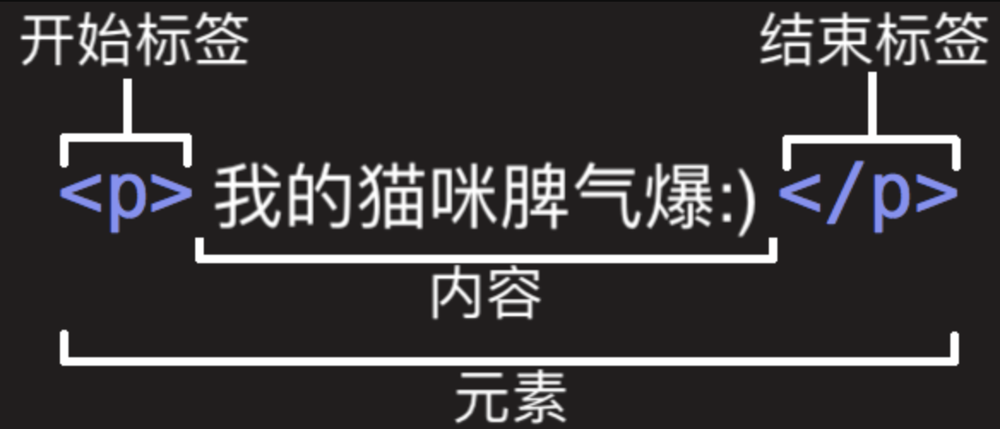

### HTML入门

[TOC]

# DONE

#### 什么是html

[HTML](https://developer.mozilla.org/zh-CN/docs/Glossary/HTML) (HyperText Markup Language) 不是一门编程语言，而是一种用来告知浏览器如何组织页面的**标记语言**。它由一系列的**元素（[elements](https://developer.mozilla.org/zh-CN/docs/Glossary/元素)）**组成，这些元素可以用来包围不同部分的内容，使其以某种方式呈现或者工作。 一对标签（[tags](https://developer.mozilla.org/zh-CN/docs/Glossary/Tag)）可以为一段文字或者一张图片添加超链接，将文字设置为斜体，改变字号，等等。

#### 剖析一个HTML元素



这个元素的主要部分有：

1. **开始标签**（Opening tag）：包含元素的名称（本例为 p），被左、右角括号所包围。表示元素从这里开始或者开始起作用 —— 在本例中即段落由此开始。
2. **结束标签**（Closing tag）：与开始标签相似，只是其在元素名之前包含了一个斜杠。这表示着元素的结尾 —— 在本例中即段落在此结束。初学者常常会犯忘记包含结束标签的错误，这可能会产生一些奇怪的结果。
3. **内容**（Content）：元素的内容，本例中就是所输入的文本本身。
4. **元素**（Element）：开始标签、结束标签与内容相结合，便是一个完整的元素。

#### 嵌套元素

```html
<p>我的猫咪脾气<strong>爆</strong>:)</p>
```

#### 块级元素和内联元素

- **块级元素**在页面中以块的形式展现 —— 相对于其前面的内容它会<u>出现在新的一行</u>，其后的内容也会被挤到下一行展现。块级元素通常用于展示页面上结构化的内容，例如<u>段落、列表、导航菜单、页脚</u>等等。<u>一个以block形式展现的块级元素不会被嵌套进内联元素中，但可以嵌套在其它块级元素中</u>。
- 内联元素通常出现在块级元素中并环绕文档内容的一小部分，而不是一整个段落或者一组内容。内联元素不会导致文本换行：它通常出现在一堆文字之间例如超链接元素<a>或者强调元素<em>和<strong>。 

```html
<em>第一</em><em>第二</em><em>第三</em>

<p>第四</p><p>第五</p><p>第六</p>
```

#### 空元素

不是所有元素都拥有开始标签，内容，结束标签。一些元素只有一个标签，通常用来在此元素所在位置插入/嵌入一些东西。例如：元素是用来在元素所在位置插入一张指定的图片。例子如下：

```html

```

#### 属性


元素可以拥有属性。属性包含元素的额外信息，这些信息不会出现在实际的内容中。在上述例子中，这个class属性给元素赋了一个识别的名字（类别），这个名字此后可以被用来识别此元素的样式信息和其他信息。

一个属性必须包含如下内容：

1. 一个空格，在属性和元素名称之间。(如果已经有一个或多个属性，就与前一个属性之间有一个空格。)
2. 属性名称，后面跟着一个等于号。
3. 一个属性值，由一对引号“ ”引起来。

关于元素<a>的——元素<a>是锚，它使被标签包裹的内容成为一个超链接。此元素也可以添加大量的属性，其中几个如下：

- `href`: 这个属性声明超链接的web地址，当这个链接被点击浏览器会跳转至href声明的web地址。例如：`href="https://www.mozilla.org/"`。
- `title`: 标题`title`属性为超链接声明额外的信息，比如你将链接至的那个页面。例如：`title="The Mozilla homepage"`。当鼠标悬停在超链接上面时，这部分信息将以工具提示的形式显示。
- `target`: 目标`target`属性用于指定链接如何呈现出来。例如，`target="_blank"`将在新标签页中显示链接。如果你希望在当前标签页显示链接，忽略这个属性即可。

#### 布尔属性

有时你会看到没有值的属性，它是合法的。这些属性被称为布尔属性，他们只能有跟它的属性名一样的属性值。例如`disabled` 属性，他们可以标记表单输入使之变为不可用(变灰色)，此时用户不能向他们输入任何数据。

```html
<!-- 使用disabled属性来防止终端用户输入文本到输入框中 -->
<input type="text" disabled>

<!-- 下面这个输入框没有disabled属性，所以用户可以向其中输入 -->
<input type="text">
```

#### 单引号或者双引号？

单引号和双引号两种都可以

```html
<a href="http://www.example.com">示例站点链接</a>

<a href='http://www.example.com'>示例站点链接</a>
```

但是单引号和双引号不能在一个属性值里混用，错误事例：

```html
<a href="http://www.example.com'>示例站点链接</a>
```

#### 剖析HTML文档

一个简单的完整HTML页面：

```html
<!DOCTYPE html>
<html>
  <head>
    <meta charset="utf-8">
    <title>我的测试站点</title>
  </head>
  <body>
    <p>这是我的页面</p>
  </body>
</html>
```

1. <!DOCTYPE html>: 声明文档类型. 很久以前，早期的HTML(大约1991年2月)，文档类型声明类似于链接，规定了HTML页面必须遵从的良好规则，能自动检测错误和其他有用的东西。使用如下：

   ```html
   <!DOCTYPE html PUBLIC "-//W3C//DTD XHTML 1.0 Transitional//EN" "http://www.w3.org/TR/xhtml1/DTD/xhtml1-transitional.dtd">
   ```

   然而这种写法已经过时了，这些内容已成为历史。只需要知道<!DOCTYPE html>是最短有效的文档声明。

2. `<html></html>`: `<html>`元素。这个元素包裹了整个完整的页面，是一个根元素。

3. `<head></head>`: `<head>`元素. 这个元素是一个容器，它包含了所有你想包含在HTML页面中但不想在HTML页面中显示的内容。这些内容包括你想在搜索结果中出现的关键字和-页面描述，CSS样式，字符集声明等等。

4. `<meta charset="utf-8">`: 这个元素设置文档使用utf-8字符集编码，utf-8字符集包含了人类大部分的文字。基本上他能识别你放上去的所有文本内容。毫无疑问要使用它，并且它能在以后避免很多其他问题。

5. `<title></title>`: 设置页面标题，出现在浏览器标签上，当你标记/收藏页面时它可用来描述页面。

6. `<body></body>`: `<body>`元素。 包含了你访问页面时所有显示在页面上的内容，文本，图片，音频，游戏等等。

#### 实体引用： 在HTML中包含特殊字符

在HTML中，字符 `<`, `>`,`"`,`'` 和 `&` 是特殊字符. 它们是HTML语法自身的一部分, 那么你如何将这些字符包含进你的文本中呢, 比如说如果你真的想要在文本中使用符号&或者小于号, 而不想让它们被浏览器视为代码并被解释?

我们必须使用字符引用 —— 表示字符的特殊编码, 它们可以在那些情况下使用. 每个字符引用以符号&开始, 以分号(;)结束.

| 原义字符 | 等价字符引用 |
| :------- | :----------- |
| <        | &lt;         |
| >        | &gt;         |
| "        | &quot;       |
| '        | &apos;       |
| &        | &amp;        |

```html
<p>HTML 中用 <p> 来定义段落元素。</p>

<p>HTML 中用 &lt;p&gt; 来定义段落元素</p>
```

在下面的实时输出中，你会看到第一段是错误的，因为浏览器会认为第二个<p>是开始一个新的段落！ 第二段是正确的，因为我们用字符引用来代替了角括号（'<'和'>'符号）.

#### 在HTML中应用CSS和JavaScript

- <link>元素经常位于文档的头部。这个link元素有2个属性，rel="stylesheet"表明这是文档的样式表，而 href包含了样式表文件的路径：

  ```html
  <link rel="stylesheet" href="my-css-file.css">
  ```

- JavaScript部分没必要非要放在文档头部；实际上，把它放在文档的尾部（在 `</body>标签之前`）是一个更好的选择，这样可以确保在加载脚本之前浏览器已经解析了HTML内容（如果脚本加载某个不存在的元素，浏览器会报错）。

```html
<script src="my-js-file.js"></script>
```

**注意：** `<script>`元素看起来像一个空元素，但它并不是，因此需要一个结束标记。您还可以选择将脚本放入`<script>`元素中，而不是指向外部脚本文件。

#### 常见元素

##### 标题

```html
<h1>我是文章的标题</h1>
```

有六个标题元素标签 —— `<h1>`、`<h2>`、`<h3>`、`<h4>`、`<h5>`、`<h6>`。每个元素代表文档中不同级别的内容; `<h1>` 表示主标题（the main heading），`<h2>` 表示二级子标题（subheadings），`<h3>` 表示三级子标题（sub-subheadings），等等。

##### 段落

```html
<p>我是一个段落，千真万确。</p>
```

##### 无序列表

```html
<ul>
  <li>豆浆</li>
  <li>油条</li>
  <li>豆汁</li>
  <li>焦圈</li>
</ul>
```

##### 有序列表

```html
<ol>
  <li>沿着条路走到头</li>
  <li>右转</li>
  <li>直行穿过第一个十字路口</li>
  <li>在第三个十字路口处左转</li>
  <li>继续走 300 米，学校就在你的右手边</li>
</ol>
```

##### 强调

```html
<p>I am <em>glad</em> you weren't <em>late</em>.</p>
```

#####  加粗

```html
<p>This liquid is <strong>highly toxic</strong>.</p>
<p>I am counting on you. <strong>Do not</strong> be late!</p>
```

##### 超链接

```html
<p>我创建了一个指向
<a href="https://www.mozilla.org/zh-CN/">Mozilla 主页</a>
的超链接。
</p>
```

##### 锚点

```html
<div id="test">111</div>
<a href="#test">click</a>
```

##### div

div 是一个块级无语义元素，应仅用于找不到更好的块级元素时，或者不想增加特定的意义时。

```html
<div class="shopping-cart">
  <h2>购物车</h2>
  <ul>
    <li>
      <p><a href=""><strong>银耳环</strong></a>：$99.95.</p>
      
    </li>
    <li>
      ...
    </li>
  </ul>
  <p>售价：$237.89</p>
</div>
```

##### span

是一个内联的（inline）无语义元素，最好只用于无法找到更好的语义元素来包含内容时，或者不想增加特定的含义时。

```html
<p>国王喝得酩酊大醉，在凌晨 1 点时才回到自己的房间，踉跄地走过门口。<span class="editor-note">[编辑批注：此刻舞台灯光应变暗]</span>.</p>
```

#### 语义化

我们需要确保使用了正确的元素来给予内容正确的意思、作用以及外形。在这里，<h1> 元素也是一个语义元素，它给出了包裹在您的页面上用来表示顶级标题的角色（或意义）的文本。

```html
<h1>这是一个顶级标题</h1>
```

一般来说，浏览器会给它一个更大的字形来让它看上去像个标题（虽然你可以使用CSS让它变成任何你想要的样式。更重要的是，它的语义值将以多种方式被使用，比如通过搜索引擎和屏幕阅读器。

在另一方面，你可以让任一元素看起来像一个顶级标题，如下：

```html
<span style="font-size: 32px; margin: 21px 0;">这是顶级标题吗？</span>
```

这是一个<span>元素，它没有语义。当您想要对它用CSS（或者JS）时，您可以用它包裹内容，且不需要附加任何额外的意义（在未来的课程中你会发现更多这类元素）。我们已经对它使用了CSS来让它看起来像一个顶级标题。然而，由于它没有语义值，所以它不会有任何上文提到的帮助。最好的方法是使用相关的HTML元素来标记这个项目。

**常用的语义化标签**：

- body
- article
- nav
- aside
- section
- header
- footer
- hgroup
- h1-h6
- address

**总结**：

- 正确的标签做正确的事情
- 页面内容结构化
- 无CSS样子时也容易阅读，便于阅读维护和理解
- 便于浏览器、搜索引擎解析。 利于爬虫标记、利于SEO


#### 参考资料

HTML语义化：https://juejin.im/entry/6844903582274174984

MDN 学习HTML：指南与教程： https://developer.mozilla.org/zh-CN/docs/Learn/HTML

