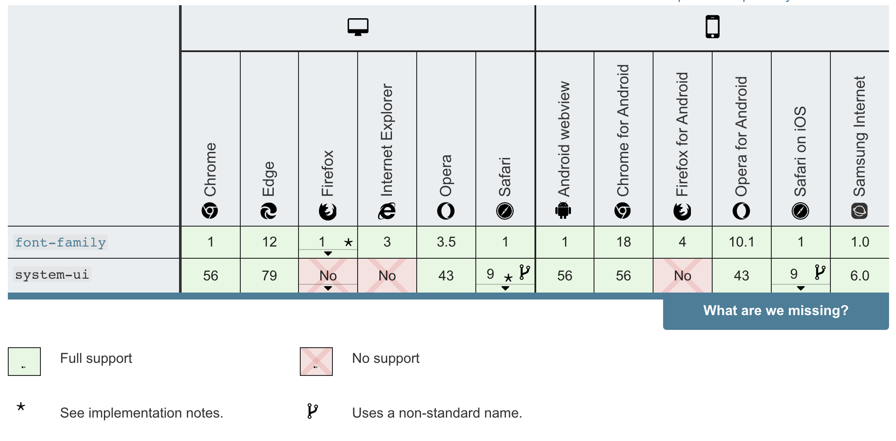

### CSS入门

[TOC]


#### 什么是CSS

**CSS** （Cascading Style Sheets，层叠样式表）是用来控制网页在浏览器中的显示外观的声明式语言。浏览器会根据 CSS 的样式定义将其选定的元素显示为恰当的形式。一条 CSS 的样式定义包括属性和属性值，它们共同决定网页的外观。

CSS 与 [HTML](https://developer.mozilla.org/zh-CN/docs/Glossary/HTML) 和 [JavaScript](https://developer.mozilla.org/zh-CN/docs/Glossary/JavaScript) 并称 Web 三大核心技术。一般用它来定义 [HTML 元素](https://developer.mozilla.org/zh-CN/docs/Glossary/元素) 的样式，但它也能用于其他标记语言，如 [SVG](https://developer.mozilla.org/zh-CN/docs/Glossary/SVG) 和 [XML](https://developer.mozilla.org/zh-CN/docs/Glossary/XML)。

CSS 中的 “C” 表示 “层叠的”，意为多个选择符之间具有特定的优先级。这一点非常重要，因为复杂网站可能会有非常多的 CSS 规则，因此必须规定好这些规则的优先级，以免乱套。

#### CSS语法

```css
h1 {
    color: red;
    font-size: 5em;
}
```

语法由一个 [选择器(selector)](https://developer.mozilla.org/zh-CN/docs/Glossary/CSS_Selector)起头。 它 *选择(selects)* 了我们将要用来添加样式的 HTML 元素。 在这个例子中我们为一级标题（主标题[``](https://developer.mozilla.org/zh-CN/docs/Web/HTML/Element/h1)）添加样式。

接着输入一对大括号`{ }`。 在大括号内部定义一个或多个形式为 **属性(property):值(value);** 的 **声明(declarations)**。每个声明都指定了我们所选择元素的一个属性，之后跟一个我们想赋给这个属性的值。

冒号之前是属性，冒号之后是值。不同的 CSS [属性(properties)](https://developer.mozilla.org/en-US/docs/Glossary/property/CSS) 对应不同的合法值。在这个例子中，我们指定了 `color` 属性，它可以接受许多[颜色值](https://developer.mozilla.org/en-US/docs/Learn/CSS/Building_blocks/Values_and_units#Color)；还有 `font-size` 属性，它可以接收许多 [size units](https://developer.mozilla.org/en-US/docs/Learn/CSS/Building_blocks/Values_and_units#Numbers_lengths_and_percentages) 值。


#### 浏览器支持

+3.

当一个浏览器支持 CSS 后，我们就可以用它来进行Web开发了。这意味着我们写在 CSS 文件中的代码可以被指令执行，展示到荧幕中。但是让所有的浏览器都同时支持一个 CSS 新特性是不现实的，通常都会一个空档期 — <u>一些浏览器已经支持而另一些仍未支持</u>。因此，查看特性的实现状态(implementation status)是非常有用的。在 MDN 上的每个属性的页面中都标有它们对应的状态，你可以通过这种方法来查看你是否可以去使用它。




#### 添加CSS

用vscode演示+快捷操作

emmet +  vscode


#### 一次使用多个选择器

```css
p, li {
  color: red;
}
```


#### 改变元素的默认行为

##### 什么是user agent stylesheet

user agent stylesheet：浏览器默认样式表

不同的浏览器的默认样式可能会不同，甚至同种浏览器不同版本的默认样式也可能不同。

```css
li {
  list-style-type: none;
}
```


#### 类选择器和id选择器

```html
<ul>
  <li>项目一</li>
  <li class="special">项目二</li>
  <li id="third">项目 <em>三</em></li>
</ul>
```

```css
li {
  
}
.special {
  color: orange;
  font-weight: bold;
}
#third {
  
}
```

元素选择器+类选择器：

```css
li.special {
	color: orange;
  font-weight: bold;
}
```

含义是：选中每个 `special` 类的 `li` 元素

id选择器：

```css
#third {
  color: red;
}
```


#### 组合选择符

##### 后代选择器

选取所有 <p> 元素插入到 <div> 元素中: 

```css
div p {
	background-color: yellow;
}
```

##### 子元素选择器

选择<div>元素中所有直接子元素 <p> 

```css
div>p {
	background-color: yellow;
}
```

##### 相邻兄弟选择器

选取所有位于 <div> 元素后的第一个 <p> 元素

```css
div+p {
  background-color: yellow;
}
```

##### 后续兄弟选择器

选取所有 <div> 元素之后的所有相邻兄弟元素 <p>

```css
div~p {
  background-color: yellow;
}
```


#### CSS伪类

CSS伪类是用来添加一些选择器的特殊效果。

##### anchor伪类

在支持 CSS 的浏览器中，链接的不同状态都可以以不同的方式显示

```css
a:link {color:#FF0000;} /* 未访问的链接 */
a:visited {color:#00FF00;} /* 已访问的链接 */
a:hover {color:#FF00FF;} /* 鼠标划过链接 */
a:active {color:#0000FF;} /* 已选中的链接 */
```

##### first-child伪类

匹配第一个<p>元素

```css
p:first-child {
  color: blue;
}
```

匹配所有作为第一个子元素的 <p> 元素中的所有 <i> 元素

```css
p:first-child i {
  color: blue;
}
```

所有CSS伪类：

https://www.runoob.com/css/css-pseudo-classes.html

#### CSS盒模型


不同部分的说明：

- **Margin(外边距)** - 清除边框外的区域，外边距是透明的。
- **Border(边框)** - 围绕在内边距和内容外的边框。
- **Padding(内边距)** - 清除内容周围的区域，内边距是透明的。
- **Content(内容)** - 盒子的内容，显示文本和图像。

##### W3C标准盒模型

width=内容的宽度

height=内容的高度

```css
box-sizing: content-box;
```

##### IE盒模型

width = border + padding + 内容的宽度

height = border + padding + 内容的高度

```css
box-sizing: border-box;
```

##### 从父元素继承box-sizing的值

```css
box-sizing: inherit;
```


#### 继承

https://juejin.im/post/6844903997459922958


#### 速记属性

一些属性，如 [`font`](https://developer.mozilla.org/zh-CN/docs/Web/CSS/font), [`background`](https://developer.mozilla.org/zh-CN/docs/Web/CSS/background), [`padding`](https://developer.mozilla.org/zh-CN/docs/Web/CSS/padding), [`border`](https://developer.mozilla.org/zh-CN/docs/Web/CSS/border), and [`margin`](https://developer.mozilla.org/zh-CN/docs/Web/CSS/margin) 等属性称为速记属性--这是因为它们允许您在一行中设置多个属性值，从而节省时间并使代码更整洁。

```css
/* 从top开始，顺时针旋转，top right bottom left */
padding: 10px 15px 15px 5px;
```

与这四行代码是等价的：

```css
padding-top: 10px;
padding-right: 15px;
padding-bottom: 15px;
padding-left: 10px;
```


#### CSS字体单位大小

https://juejin.im/post/6844903897421578253


#### 参考资料

MDN CSS教程：https://developer.mozilla.org/zh-CN/docs/Learn/CSS

